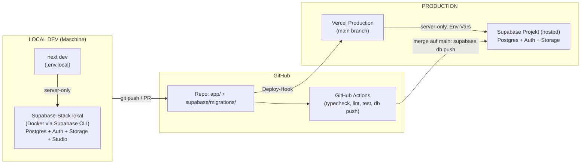

# Infrastruktur-Setup-Plan: Local Dev & Production (Vercel + Supabase)

**Datum:** 2026-05-31
**Bezug:** `2026-05-31-kifu-architektur-mvp.md` (server-only-Architektur)
**Ziel:** Reproduzierbares Setup für zwei Umgebungen — lokale Entwicklung und Produktion —
beide auf Vercel (Next.js) + Supabase (Postgres/Auth/Storage), mit versionierten Migrationen
und einem idempotenten Seed. Server-only bleibt durchgängig gewahrt: keine DB-Credentials im
Browser.

---

## 1. Umgebungs-Topologie

Zwei feste Umgebungen (MVP); Preview optional als Ausbaustufe.



| Aspekt | Local Dev | Production |
|--------|-----------|------------|
| Next.js | `next dev` auf `localhost:3000` | Vercel (Production-Deployment, `main`) |
| Supabase | lokaler Docker-Stack (Supabase CLI) | gehostetes Supabase-Projekt |
| DB-URL | `http://127.0.0.1:54321` | `https://<ref>.supabase.co` |
| Env-Quelle | `.env.local` (lokale Keys, stabil) | Vercel Env-Vars (Production-Scope) |
| Migrationen | `supabase db reset` | `supabase db push` (via CI) |
| Daten-Seed | `npm run seed` gegen lokal | `npm run seed` gegen Prod (einmalig/CI) |
| Kosten | 0 (alles lokal) | Supabase Free + Vercel Hobby = 0 CHF |

**Optionaler Ausbau (später):** Vercel-Preview-Deployments pro PR + Supabase **Branching**
(ephemere DB-Branches je Git-Branch, integriert mit Vercel). Setzt Supabase Pro voraus —
für den MVP bewusst weggelassen.

---

## 2. Tooling-Voraussetzungen (einmalig lokal)

| Tool | Zweck | Installation |
|------|-------|--------------|
| Node ≥ 20 LTS | Next.js Runtime | nvm / Installer |
| npm (oder pnpm) | Paketmanager | mit Node |
| Docker Desktop | lokaler Supabase-Stack | docker.com |
| Supabase CLI | lokaler Stack, Migrationen, Typen | `brew install supabase/tap/supabase` |
| Vercel CLI | Verknüpfung, Env-Pull, Deploy | `npm i -g vercel` |
| GitHub CLI (`gh`) | Repo/Secrets/Actions | `brew install gh` |

---

## 3. Repo-Layout (Ziel)

Die App lebt im selben Repo (`kifu/`) unter `app/`-Strukturen; die Daten-Pipeline (Python)
bleibt unberührt daneben.

```
kifu/
├── data/                      # bestehende YAML (kanonische Manual-Quelle) — unverändert
├── images/                    # bestehende PNG — unverändert
├── scripts/                   # bestehende Python-Pipeline — unverändert
├── web/                       # NEU: die Next.js-App (eigener Package-Root)
│   ├── app/                   # App Router (siehe Architektur-Plan §6)
│   ├── lib/
│   ├── components/
│   ├── package.json
│   ├── next.config.ts
│   ├── .env.local             # lokale Supabase-Keys (NICHT committen)
│   └── .env.example           # Vorlage (committen)
├── supabase/                  # NEU: Supabase CLI-Projekt
│   ├── config.toml
│   ├── migrations/            # versionierte SQL-Migrationen (single source of truth)
│   └── seed.sql               # optionale reine SQL-Stammdaten (z.B. Themen)
└── seed/                      # NEU: Daten-Seed (YAML→DB+Storage)
    └── seed.ts                # idempotenter Upsert der 75 Übungen + Bild-Upload
```

Begründung `web/` als Unterordner: hält die Node-Welt sauber getrennt von der Python-Pipeline;
Vercel wird auf das Root-Directory `web/` konfiguriert.

---

## 4. Server-only Env-Variablen (zentral)

Wichtig: **Keine `NEXT_PUBLIC_`-Supabase-Variablen.** Der Browser braucht weder URL noch
Keys — sie bleiben serverseitig. Das ist der konkrete Hebel des server-only-Entscheids.

| Variable | Inhalt | Local-Wert | Prod-Wert | Sichtbarkeit |
|----------|--------|------------|-----------|--------------|
| `SUPABASE_URL` | API-URL | `http://127.0.0.1:54321` | `https://<ref>.supabase.co` | nur Server |
| `SUPABASE_ANON_KEY` | anon-Key (öffentliche Reads, RLS aktiv) | aus `supabase start` | aus Supabase-Dashboard | nur Server |
| `SUPABASE_SERVICE_ROLE_KEY` | RLS-umgehend | aus `supabase start` | aus Supabase-Dashboard | **nur Seed/CI**, nie in der App-Request-Pipeline |
| `SUPABASE_DB_PASSWORD` | für `db push` | — | aus Dashboard | nur CI/CLI |

- **Local:** `.env.local` in `web/` — die lokalen Keys sind statisch und werden von
  `supabase start` ausgegeben (ändern sich nicht). `.env.example` als committete Vorlage.
- **Production:** Vercel-Dashboard → Project → Settings → Environment Variables, Scope
  **Production** (und Preview, falls genutzt). `SERVICE_ROLE_KEY` setzt man dort nur, wenn der
  Seed aus Vercel laufen soll — sonst bleibt er ausschliesslich in den GitHub-Actions-Secrets.

---

## 5. Supabase einrichten

### 5.1 Lokaler Stack (einmalig + täglich)

```bash
# einmalig, legt supabase/ an
supabase init

# täglich: lokalen Stack starten (Docker)
supabase start
# -> druckt API URL, anon key, service_role key, Studio URL  --> in web/.env.local eintragen

supabase stop          # Feierabend
```

`supabase start` liefert lokale Postgres + Auth + Storage + Studio (`http://127.0.0.1:54323`).
Magic-Link-Mails landen lokal im integrierten **Inbucket** (kein echter Mailversand nötig).

### 5.2 Produktions-Projekt (einmalig)

1. Auf supabase.com ein Projekt anlegen (Region EU, z.B. Frankfurt — Daten in der EU/CH-Nähe).
2. Projekt-`ref`, `anon key`, `service_role key`, DB-Passwort aus dem Dashboard notieren.
3. CLI mit dem Projekt verknüpfen:

```bash
supabase link --project-ref <prod-ref>
```

---

## 6. Migrations-Workflow (single source of truth = SQL im Repo)

Schema-Änderungen entstehen **immer** als versionierte Migration im Repo, nie per Klick im
Dashboard.

```bash
# neue Migration anlegen
supabase migration new init_exercises_and_rls
# -> supabase/migrations/<timestamp>_init_exercises_and_rls.sql  (SQL aus Architektur-Plan §4/§5 einfügen)

# lokal anwenden (drop + recreate + alle Migrationen + seed.sql)
supabase db reset

# TS-Typen aus dem lokalen Schema generieren (für getypte Queries)
supabase gen types typescript --local > web/lib/database.types.ts
```

**Promotion nach Production:** geschieht über `supabase db push` (manuell oder via CI, §9).
Reihenfolge der Migrationen ist durch die Timestamps deterministisch.

```bash
supabase db push      # wendet noch nicht angewandte Migrationen auf das verknüpfte Prod-Projekt an
```

---

## 7. Seed-Workflow (Manual-Daten → DB + Storage)

Zwei Teile, klar getrennt:
- **Schema** kommt aus Migrationen (§6).
- **Daten** (75 Übungen, 4 Themen, 75 Bilder) kommen aus `seed/seed.ts` — liest die
  bestehenden `data/*.yaml` + `images/*.png`, validiert gegen `schema/uebung.schema.json`,
  macht **Upsert per `slug`** (`source='manual'`, `owner_id=NULL`) und lädt Bilder in den
  Storage-Bucket. Idempotent: mehrfach ausführbar ohne Duplikate; User-Daten bleiben unberührt.

```bash
# lokal (gegen .env.local -> lokaler Stack)
npm run seed

# Production (einmalig nach erstem db push; ENV gegen Prod gesetzt)
SUPABASE_URL=https://<ref>.supabase.co \
SUPABASE_SERVICE_ROLE_KEY=<prod-service-role> \
npm run seed
```

Der Seed nutzt den `service_role`-Key (bewusst RLS-umgehend, vertrauenswürdiger Kontext) —
deshalb läuft er nur aus CLI/CI, nie aus der App.

---

## 8. Vercel einrichten

1. Repo bei Vercel importieren; **Root Directory = `web/`** setzen.
2. Framework-Preset: Next.js (auto). Build/Output default.
3. **Git-Integration:**
   - Production Branch = `main` → jeder Merge nach `main` deployt Production.
   - Pull Requests → automatische **Preview-Deployments** (optional nutzbar).
4. **Env-Variablen** (Settings → Environment Variables): `SUPABASE_URL`, `SUPABASE_ANON_KEY`
   im Scope **Production** (und Preview). Keine `NEXT_PUBLIC_`-Supabase-Vars.
   - `APP_ORIGIN=https://<prod-domain>` (z. B. `https://kifutraining.vercel.app`): kanonischer
     Origin für Auth-Redirects (Magic-Link/Signup-Bestätigung), nagelt gegen Host-Header-Spoofing.
     **Muss exakt** mit Supabase Auth → URL Configuration → **Site URL** und der **Redirect-Allowlist**
     (`https://<prod-domain>/**`) übereinstimmen, sonst landen Bestätigungslinks auf localhost.
     Env-Änderung greift erst nach einem **Redeploy**; die Supabase-Auth-Config greift sofort.
5. Lokal verknüpfen (optional, für `vercel env pull`):

```bash
cd web
vercel link
vercel env pull .env.production.local   # nur falls man Prod-Vars lokal spiegeln will
```

Für den normalen lokalen Dev-Loop zeigt `.env.local` aber auf den **lokalen** Supabase-Stack,
nicht auf Prod.

---

## 9. CI/CD (GitHub Actions)

Zwei Workflows, beide mit GitHub-Secrets (`SUPABASE_PROD_REF`, `SUPABASE_DB_PASSWORD`,
`SUPABASE_SERVICE_ROLE_KEY`, `SUPABASE_ACCESS_TOKEN`).

**A) PR-Checks** (`on: pull_request`):
- `npm ci`, `npm run typecheck`, `npm run lint`, `npm test`
- optional: Migrationen gegen einen Wegwerf-Postgres anwenden (`supabase db reset` im CI-Container) → fängt kaputte Migrationen früh.

**B) Deploy** (`on: push: branches: [main]`):
1. `supabase link --project-ref $SUPABASE_PROD_REF`
2. `supabase db push` (Migrationen nach Prod)
3. (Vercel deployt parallel automatisch über die Git-Integration — kein eigener Step nötig.)

Der **Daten-Seed läuft nicht bei jedem Deploy** (die Manual-Daten ändern sich selten). Er ist
ein separater, manuell auslösbarer Workflow (`workflow_dispatch`) bzw. CLI-Aufruf, der `npm run
seed` gegen Prod fährt — z.B. nach einer Datenkorrektur an den YAML.

---

## 10. Setup-Reihenfolge (Runbook, von Null)

1. **Tooling** installieren (§2).
2. `supabase init` → `supabase/` entsteht.
3. **App scaffolden:** `npx create-next-app@latest web` (TS, App Router, Tailwind).
4. **Erste Migration** schreiben (Schema + RLS aus Architektur-Plan §4/§5), `supabase start`,
   `supabase db reset`, Typen generieren.
5. `seed/seed.ts` schreiben, `npm run seed` lokal → 75 Übungen lokal sichtbar.
6. Lokal entwickeln gegen den lokalen Stack (M2 ff. der Architektur-Build-Sequenz).
7. **Production-Projekt** anlegen + `supabase link` (§5.2).
8. **Vercel-Projekt** anlegen, Root `web/`, Env-Vars setzen (§8).
9. **GitHub-Secrets** setzen, beide Actions-Workflows committen (§9).
10. Ersten Merge nach `main`: CI `db push` → Vercel deployt → einmalig `npm run seed` gegen Prod.
11. Smoke-Test: öffentliche Übungsliste lädt, Magic-Link-Login funktioniert, eine eigene Übung
    anlegen/sichtbar schalten.

---

## 11. Tägliche Entwicklungs-Schleife

```bash
supabase start                 # lokaler Stack hoch
cd web && npm run dev          # Next.js auf :3000 gegen lokalen Supabase

# Schema ändern:
supabase migration new <name>  # SQL editieren
supabase db reset              # lokal anwenden (+ seed.sql)
npm run seed                   # Manual-Daten neu laden (falls nötig)
supabase gen types typescript --local > web/lib/database.types.ts

# fertig -> branch, PR -> CI prüft -> merge main -> Prod-Migration + Deploy
```

---

## 12. Sicherheits-Checkliste (server-only durchgehalten)

- [ ] Keine `NEXT_PUBLIC_SUPABASE_*`-Variablen im Repo oder Vercel.
- [ ] `web/.env.local` und `*.local` in `.gitignore`.
- [ ] `service_role`-Key nur in GitHub-Actions-Secrets bzw. lokaler Seed-ENV — nicht in Vercel-Runtime-Vars der App.
- [ ] RLS auf allen Tabellen aktiviert (Migration enthält `enable row level security`).
- [ ] Storage-Bucket `exercise-images`: öffentlich nur **lesend**; Schreiben ausschliesslich serverseitig.
- [ ] Production-Supabase: E-Mail-Auth (Magic Link) mit korrekter Redirect-URL der Vercel-Prod-Domain konfiguriert.

---

## 13. Verbleibende Entscheide

1. ~~**Preview-Umgebung jetzt oder später?**~~ **Entschieden (2026-08-14):** separates
   `staging`-Supabase-Projekt (Free) + `develop`-Branch → Vercel Preview mit fester Domain
   staging.ki-fu.ch. Migrationen via `deploy-staging.yml`, Daten via manuellem Prod-Spiegel
   `sync-staging.yml`. Siehe CLAUDE.md, Abschnitt „CI / Deploy".
2. **Seed aus CI gegen Prod automatisieren** oder bewusst manuell halten? Empfehlung: manuell
   (`workflow_dispatch`), da Manual-Daten selten ändern und ein versehentliches Überschreiben
   so ausgeschlossen ist.
3. **Region des Prod-Supabase-Projekts** — Empfehlung EU (Frankfurt/Zürich-nah), da Nutzung primär CH.
