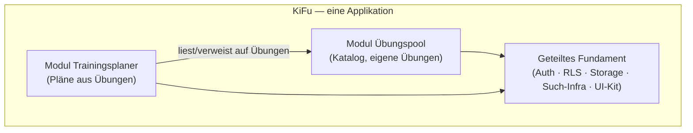
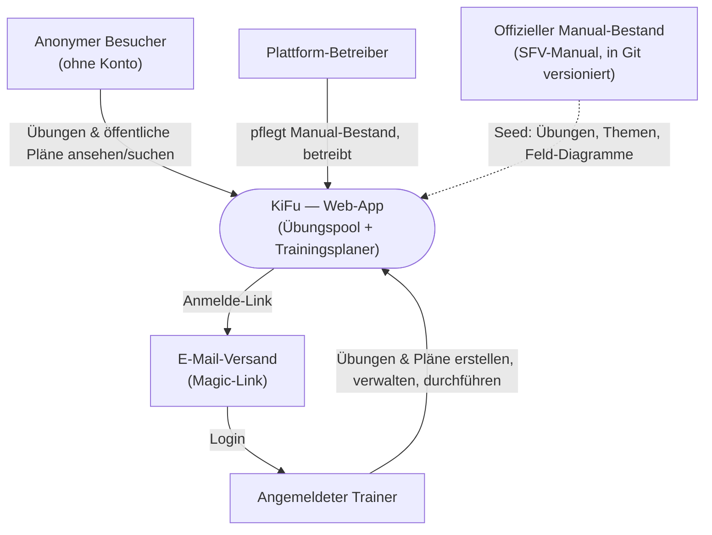
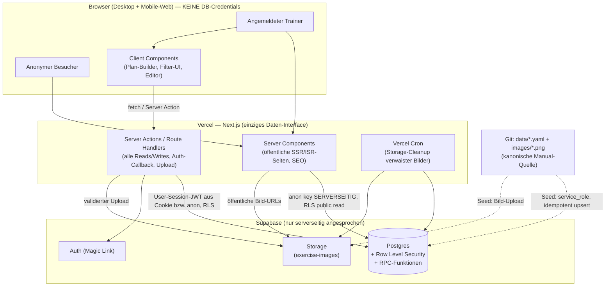
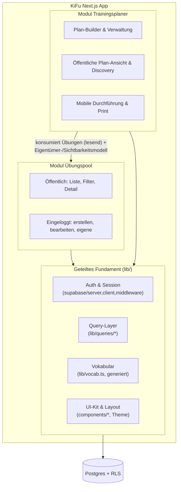
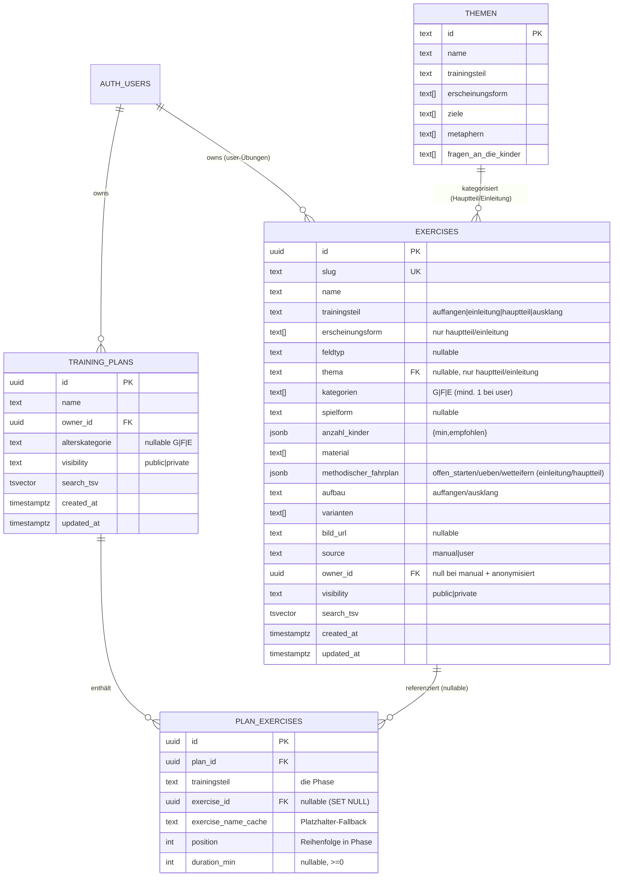
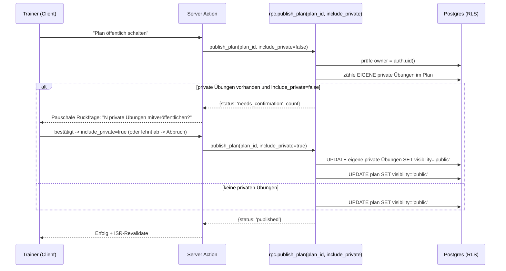

# KiFu — Architektur (MVP)

**Datum:** 2026-05-31 (zuletzt erweitert 2026-06-01)
**Status:** Architektur-Spec für den MVP — deckt die ganze Applikation ab
**Geltungsbereich:** Dies beschreibt ausdrücklich den **MVP**. Bewusst
ausgeklammerte Themen sind in §19 (Post-MVP-Ausblick) gesammelt.

**Grundlage:**
- `2026-05-31-uebungspool-epic.md` + `2026-06-01-uebungspool-stories.md` (Modul Übungspool)
- `2026-05-31-trainingsplaner-requirements-epic.md` (Modul Trainingsplaner)
- `2026-05-31-uebungs-datenbank-design.md` + `2026-06-01-methodischer-fahrplan-design.md` + `schema/uebung.schema.json` (kanonische Datenform)

---

## 1. Was ist KiFu?

**KiFu** ist eine einzige Web-Applikation für das Kinderfussball-Training, die aus
**zwei fachlichen Modulen** besteht, die sich eine gemeinsame technische Basis teilen:

- **Modul Übungspool** — der durchsuch- und filterbare Übungskatalog (offizieller
  Manual-Bestand plus eigene Übungen der Trainer) inkl. Erfassung, Sichtbarkeit und
  Konto-Verwaltung.
- **Modul Trainingsplaner** — stellt aus dem Übungspool nach den vier Trainingsteilen
  gegliederte Trainingspläne zusammen, plant Dauern, verwaltet, teilt und führt sie
  am Spielfeldrand durch.

Beide Module leben in **einer Codebasis**, **einer Datenbank** und **einem Deployment**.
Der Trainingsplaner baut auf dem Übungspool auf (er konsumiert dessen Übungen und sein
Eigentümer-/Sichtbarkeitsmodell), nie umgekehrt — das ist die zentrale Modulgrenze (§6).



---

## 2. Architektur-Leitplanken (aus den NFRs beider Module)

- Öffentliche Ansicht **ohne Konto** voll nutzbar und **SEO-fähig** → Server-Rendering.
- Schreiben **nur authentifiziert**, serverseitig gegen Fremdzugriff abgesichert →
  **Row Level Security (RLS) als primäre Autorisierung**.
- Grössenordnung: niedrige vierstellige Übungszahl, einige Dutzend gleichzeitige
  Nutzer → **keine Skalierungs-Sonderarchitektur**, Standard-Postgres genügt.
- Mobil + Desktop, Deutsch, **kein Offline** (explizit out of scope beider Module).
- Trainer nutzen die App **am Spielfeldrand** → mobile Lesbarkeit und schnelle Ladezeit
  sind erstrangig (besonders die Durchführungsansicht des Planers).

---

## 3. Tech-Stack (bestätigt) & Begründung

| Schicht | Wahl | Begründung |
|--------|------|-----------|
| Framework | **Next.js (App Router, TypeScript)** | Server Components für SEO/öffentliche Seiten, Server Actions für Mutationen, eine Codebasis für Web + Mobile-Web |
| UI | **Tailwind CSS** | schnelle, konsistente, responsive UI; Print-Styles via `@media print` |
| DB | **Supabase Postgres** | relationales Modell passt 1:1 zu Übungen/Plänen; RLS als Autorisierung |
| Auth | **Supabase Auth (Magic Link)** | passwortlos, geringe Friktion für Hobby-Trainer; der zugesandte Link weist den E-Mail-Besitz nach |
| Storage | **Supabase Storage** | Feld-Diagramme (Manual-Seed + User-Uploads) |
| Hosting | **Vercel** | native Next.js-Integration, ISR, Edge, Cron |
| Auth-Bridge | **`@supabase/ssr`** | Cookie-basierte Session über Server Components + Server Actions |

Bewusst **nicht** im MVP: ORM-Schwergewicht (rohe SQL-Migrationen + generierte Typen
reichen), eigener API-Layer (Supabase-Client + Server Actions genügen), Service
Worker/PWA (Offline out of scope), serverseitiger PDF-Renderer (siehe §13).

**Entscheidungs-Historie (Decision Record):** Stack (Next.js + Supabase + Vercel) und
Zugriffsmodell (öffentlich lesen ohne Konto, passwortloser Login nur zum Schreiben, jeder
bearbeitet nur eigene Inhalte, Manual-Bestand schreibgeschützt) wurden am 2026-05-31 als
Grobarchitektur mit dem Auftraggeber entschieden — zunächst für den Übungspool, später auf
den Trainingsplaner ausgeweitet. Dieses Dokument ist die ausgearbeitete, app-weite Fassung
dieses Entscheids und gilt vor; eine frühere separate Entscheid-Notiz wurde hierin
aufgelöst.

---

## 4. System-Kontext (C4 — Level 1)



---

## 5. Container-Sicht (C4 — Level 2): server-only



**Kernidee (server-only):** Der **Browser hält keine DB-Credentials** und spricht nie
direkt mit Supabase. Das einzige Daten-Interface ist der Next.js-Server. Interaktive
Client Components rufen **Server Actions / Route Handlers** auf; diese greifen mit dem
passenden Schlüssel auf Postgres zu. **RLS bleibt als zweite Schutzschicht** aktiv —
selbst ein Bug im Server-Code kann private Daten nicht freigeben.

**Schlüssel-Handhabung (verlässt nie den Server):**
- **`anon`-Key** — nur serverseitig, für anonyme öffentliche Reads. RLS bleibt aktiv (nur `public`-Zeilen). Wird **nicht** ins Browser-Bundle ausgeliefert.
- **User-Session (JWT in HttpOnly-Cookie via `@supabase/ssr`)** — pro Request serverseitig zu einem Supabase-Client gemacht; `auth.uid()` trägt die RLS-Eigentümer-Policies.
- **`service_role`-Key** — RLS-umgehend, **ausschließlich** im Seed-Script / vertrauenswürdigen Admin-Kontext. Niemals in der App-Request-Pipeline.

---

## 6. Modul-Architektur (C4 — Level 3) & Modulgrenzen



**Modulgrenzen (bewusst gesetzt):**

1. **Abhängigkeitsrichtung ist einseitig.** Der Trainingsplaner liest Übungen und nutzt
   das Eigentümer-/Sichtbarkeitsmodell des Übungspools. Der Übungspool kennt den Planer
   **nicht** — keine Plan-Logik sickert in den Katalog. So bleibt der Übungspool
   eigenständig auslieferbar (er ist die Precondition des Planers).
2. **Integration über den Query-Layer, nicht über UI-Kopplung.** Der Planer greift auf
   Übungen ausschliesslich über `lib/queries/exercises.ts` zu (dieselben RLS-gefilterten
   Reads wie der Katalog). Es gibt keinen zweiten Datenpfad zu Übungen.
3. **Gemeinsame Sicht-Regel.** Welche Übungen ein Trainer im Planer auswählen darf, ist
   exakt die `ex_select`-Sichtbarkeit aus dem Übungspool (Manual + eigene öffentliche/
   private + fremde öffentliche). Es gibt keine planer-spezifische Sichtbarkeitsregel.
4. **Geteiltes Fundament ist modulneutral.** Auth, RLS-Konventionen, Storage-Zugriff,
   Vokabular und UI-Kit gehören keinem Modul; beide Module hängen daran, nicht
   aneinander (ausser der einen erlaubten Richtung oben).

---

## 7. Datenmodell



### 7.1 Designentscheide im Modell

- **Phasen sind kein eigenes Table.** Die 4 Trainingsteile sind eine feste,
  unveränderliche Sequenz (Planer-EK1). Sie werden als `trainingsteil`-Wert auf
  `plan_exercises` geführt und in der UI als feste Reihenfolge gerendert. Kein
  `phases`-Table, keine konfigurierbare Reihenfolge → weniger Komplexität.
- **Eine Übung = genau ein `trainingsteil`** (durch die Daten bestätigt). Die
  Phasen-Bindung (Planer-EK2) ist damit ein einfacher Gleichheits-Check
  `plan_exercises.trainingsteil = exercises.trainingsteil`.
- **`erscheinungsform`/`thema` bei Hauptteil UND Einleitung** wird per CHECK-Constraint
  erzwungen (siehe DDL), nicht nur in der UI.
- **Manual vs. User über `source` + `owner_id`**: `source='manual'` ⇒ `owner_id IS NULL`,
  schreibgeschützt via RLS. `source='user'` ⇒ `owner_id` gesetzt.
- **Übungsablauf als `methodischer_fahrplan` (jsonb)** für Einleitung und Hauptteil
  (Stufen `offen_starten`/`ueben`/`wetteifern`), `aufbau` (text) für Auffangen und
  Ausklang. Bei nutzererstellten Einleitungs-/Hauptteil-Übungen sind **alle drei
  Fahrplan-Stufen Pflicht**; der Altbestand darf `ueben`/`wetteifern` leer haben.
- **Filter-Vokabular** bleibt kanonisch in `data/vokabular.yaml`, wird **als generiertes
  TS-Modul** mit-deployed (Dropdown-Werte) **und** als CHECK-Enums in der DB gespiegelt.
  Ein Test hält beide synchron. Kein separates `vocabulary`-Table → keine Drift-Quelle.

### 7.2 Schema (DDL-Skizze, Soll-Stand)

```sql
create table exercises (
  id uuid primary key default gen_random_uuid(),
  slug text unique not null,
  name text not null,
  trainingsteil text not null
    check (trainingsteil in ('auffangen','einleitung','hauptteil','ausklang')),
  erscheinungsform text[] not null default '{}',
  feldtyp text check (feldtyp in ('kleinfeld','grossfeld','freies_feld')),
  thema text references themen(id),
  kategorien text[] not null default '{}',
  spielform text,
  anzahl_kinder jsonb,
  material text[] not null default '{}',
  methodischer_fahrplan jsonb,        -- {offen_starten, ueben[], wetteifern} bei einleitung/hauptteil
  aufbau text,                        -- bei auffangen/ausklang
  varianten text[] not null default '{}',
  bild_url text,
  source text not null default 'user' check (source in ('manual','user')),
  owner_id uuid references auth.users(id) on delete set null,
  visibility text not null default 'private' check (visibility in ('public','private')),
  search_tsv tsvector,
  created_at timestamptz not null default now(),
  updated_at timestamptz not null default now(),
  constraint manual_has_no_owner check (source <> 'manual' or owner_id is null),
  -- Themen-/Erscheinungsform-Felder bei Hauptteil ODER Einleitung
  constraint themenfelder_nur_haupt_einleitung check (
    trainingsteil in ('hauptteil','einleitung')
    or (erscheinungsform = '{}' and thema is null)
  )
);

create table training_plans (
  id uuid primary key default gen_random_uuid(),
  name text not null,
  owner_id uuid not null references auth.users(id) on delete cascade,
  alterskategorie text check (alterskategorie in ('G','F','E')),
  visibility text not null default 'private' check (visibility in ('public','private')),
  search_tsv tsvector,
  created_at timestamptz not null default now(),
  updated_at timestamptz not null default now()
);

create table plan_exercises (
  id uuid primary key default gen_random_uuid(),
  plan_id uuid not null references training_plans(id) on delete cascade,
  trainingsteil text not null
    check (trainingsteil in ('auffangen','einleitung','hauptteil','ausklang')),
  exercise_id uuid references exercises(id) on delete set null,
  exercise_name_cache text,
  position int not null,
  duration_min int check (duration_min >= 0),
  unique (plan_id, trainingsteil, position)
);

create index exercises_search_idx on exercises using gin(search_tsv);
create index exercises_filter_idx on exercises (trainingsteil, visibility);
create index exercises_owner_idx on exercises (owner_id);
create index plan_exercises_plan_idx on plan_exercises (plan_id);
create index plans_search_idx on training_plans using gin(search_tsv);
```

`search_tsv` wird per Trigger mit der `german`-Konfiguration befüllt; `pg_trgm`
zusätzlich für tolerante Namenssuche.

### 7.3 Abweichungen zum bereits implementierten Schema

Das im Repo vorhandene Schema (`supabase/migrations/`) entstand vor zwei
Story-Entscheidungen vom 2026-06-01 und vor dem `methodischer_fahrplan`-Design. Vor der
Umsetzung anzugleichen:

- **Themenfelder auch bei Einleitung:** implementierte Bedingung `hauptteil_only_fields`
  → auf `hauptteil` ODER `einleitung` erweitern; Themen-Daten und Alterskategorie-
  Korrektur müssen Einleitungs-Übungen einbeziehen.
- **Default-Sichtbarkeit privat:** implementierter Default `visibility='public'` → auf
  `'private'` ändern (neue Nutzer-Übungen sind Entwürfe). Der Manual-Seed setzt `public`
  weiterhin explizit.
- **Übungsablauf-Felder:** flaches `aufbau`/`ueben`/`wetteifern` → `methodischer_fahrplan`
  (jsonb) für Einleitung/Hauptteil, `aufbau` für Auffangen/Ausklang. Offen: jsonb-Block
  vs. Abflachen im Seed (Detail-Spec).

---

## 8. Autorisierung (RLS — die Sicherheitsgrenze)

Alle Tabellen: `enable row level security`. RLS ist die **einzige** Autorisierungsschicht;
die App verlässt sich nicht auf clientseitige Checks (NFR „Schreiben nur auth" beider Module).

```sql
-- EXERCISES
create policy ex_select on exercises for select
  using (visibility = 'public' or owner_id = auth.uid());
create policy ex_insert on exercises for insert
  with check (owner_id = auth.uid() and source = 'user');
create policy ex_update on exercises for update
  using (owner_id = auth.uid() and source = 'user')
  with check (owner_id = auth.uid() and source = 'user');
create policy ex_delete on exercises for delete
  using (owner_id = auth.uid() and source = 'user');

-- TRAINING_PLANS
create policy pl_select on training_plans for select
  using (visibility = 'public' or owner_id = auth.uid());
create policy pl_write on training_plans for all
  using (owner_id = auth.uid()) with check (owner_id = auth.uid());

-- PLAN_EXERCISES (Sichtbarkeit/Schreibrecht erbt vom Eltern-Plan)
create policy pe_select on plan_exercises for select using (
  exists (select 1 from training_plans p where p.id = plan_id
          and (p.visibility = 'public' or p.owner_id = auth.uid())));
create policy pe_write on plan_exercises for all using (
  exists (select 1 from training_plans p where p.id = plan_id
          and p.owner_id = auth.uid()))
  with check (
  exists (select 1 from training_plans p where p.id = plan_id
          and p.owner_id = auth.uid()));
```

**Konsequenzen, die Anforderungen direkt erfüllen:**
- Manual-Übungen (`owner_id IS NULL`) sind für niemanden schreibbar (keine Schreib-Policy trifft zu).
- Eigene private Übungen sieht **nur der Owner** — derselbe `ex_select`-Filter trägt im
  Katalog UND im Planer-Auswahldialog (eine Sicht-Regel, keine Drift).
- Ein öffentlicher Plan mit einer fremden, inzwischen privatisierten Übung liefert über
  die `pe_select`/`ex_select`-Kette keine Übungsdaten → die App zeigt den **Platzhalter
  aus `exercise_name_cache`** (§9.3).

---

## 9. Schlüssel-Flows

### 9.1 Öffentliches Filtern im Übungspool (conditional Erscheinungsform/Thema)

Die Filter-UI blendet `Erscheinungsform`/`Thema` nur ein, wenn `trainingsteil` auf
`hauptteil` oder `einleitung` steht. Die Query baut dynamisch `WHERE`-Klauseln:
`trainingsteil`, `kategorien && :selected` (Mehrfachauswahl, Überlappung), Spieleranzahl
(verfügbare Gruppengrösse: `anzahl_kinder.min <= :verfügbar`), Volltext über `search_tsv`.
Der Alterskategorie-Filter setzt **korrigierte Kategorie-Daten** voraus (Release-Blocker
laut Stories, Daten-Precondition, keine Architektur-Frage).

### 9.2 Plan veröffentlichen mit eigenen privaten Übungen (transaktional)

Planer-EK9 verlangt eine atomare, pauschale Entscheidung → **Postgres-RPC** (eine
Transaktion, keine Race-Condition zwischen mehreren Client-Writes):



Lehnt der Trainer ab, bleibt alles privat (keine Mutation). Die RPC läuft
`SECURITY DEFINER` mit explizitem Owner-Check als erster Anweisung.

### 9.3 Referenzielle Integrität (Planer-Architekt-Frage 2)

**Entscheid:** `plan_exercises.exercise_id` ist FK mit `ON DELETE SET NULL`; beim
Hinzufügen wird `exercise_name_cache` mitgespeichert. Beim Rendern eines Plans:
- Übung sichtbar → volle Daten via Join.
- Übung gelöscht (`exercise_id IS NULL`) **oder** für den Betrachter unsichtbar (RLS
  liefert keine Zeile) → **Platzhalter** „Übung nicht mehr verfügbar" aus
  `exercise_name_cache`; die Plan-Struktur (Phasen, Reihenfolge, Dauer) bleibt intakt.

Kein Voll-Snapshot des Übungsinhalts im MVP (vermeidet Daten-Duplikation/Staleness).

### 9.4 Konto löschen mit Anonymisierung (Übungspool)

RPC `delete_account()`: setzt bei öffentlichen Übungen des Users `owner_id = NULL`
(anonymisiert, bleibt erhalten, durch fehlende Update-Policy unveränderlich), löscht
private Übungen, löscht den Auth-User. Eigene Pläne hängen per `ON DELETE CASCADE` am
User — im MVP werden Pläne mit dem Konto gelöscht (öffentliche Pläne anonymisiert zu
erhalten ist nicht gefordert → Produktentscheid §17/§19).

---

## 10. Rendering- & Routing-Strategie (eine App, zwei Module)

```
app/
  (public)/                      # SSR/ISR, anon Supabase-Client, SEO
    page.tsx                     # [Übungspool] Übungsliste + Filter
    uebung/[slug]/page.tsx       # [Übungspool] Übungs-Detail (Themen-Infos, SFV-Quelle bei Manual)
    plaene/page.tsx              # [Planer] Öffentliche Plan-Discovery
    plan/[id]/page.tsx           # [Planer] Öffentliche Plan-Ansicht
  (auth)/
    login/page.tsx               # Magic-Link
    auth/callback/route.ts       # Session-Austausch
  (app)/                         # nur eingeloggt (Middleware-Guard + RLS)
    neu/page.tsx                 # [Übungspool] Übung erstellen
    uebung/[slug]/edit/page.tsx  # [Übungspool] Übung bearbeiten
    meine-uebungen/page.tsx      # [Übungspool] eigene Übungen
    plan/neu/page.tsx            # [Planer] Plan-Builder
    plan/[id]/edit/page.tsx      # [Planer] Plan-Builder (bearbeiten)
    meine-plaene/page.tsx        # [Planer] eigene Pläne
    plan/[id]/durchfuehrung/page.tsx  # [Planer] Mobile Durchführungsansicht
    plan/[id]/print/page.tsx     # [Planer] Print-optimierte Ansicht für PDF
    konto/page.tsx               # Konto löschen
lib/
  supabase/{server,client,middleware}.ts   # geteilt
  queries/{exercises,plans}.ts              # geteilt — einziger Datenpfad
  vocab.ts                                  # generiert aus data/vokabular.yaml
components/...                               # geteiltes UI-Kit
supabase/
  migrations/*.sql
  functions/                                # RPC (publish_plan, delete_account)
scripts/
  seed.ts                                   # YAML+Bilder -> Postgres/Storage (idempotent)
```

- **Öffentlich = Server Components + ISR.** SEO + <1s-Antwort; Revalidierung on-demand
  nach Mutationen; Datenzugriff serverseitig mit dem anon-Key.
- **Interaktiv = Client Components ohne eigenen DB-Client.** Plan-Builder, Filter-Sidebar
  und Formulare halten lokalen UI-State und sprechen die DB ausschliesslich über Server
  Actions / Route Handlers an. Kein direkter Browser→Supabase-Call (ausser Auth).
- **Auth-Guard** in der Middleware für `(app)/*` — UX-Schutz; die echte Durchsetzung
  bleibt RLS.

---

## 11. Storage (Feld-Diagramme)

- Ein **öffentlicher Bucket `exercise-images`** für die Auslieferung (Lesen). Manual-Bilder
  beim Seed hochgeladen; User-Uploads unter `user/<owner_id>/<exercise_id>.<ext>`.
- **Upload server-only:** Datei geht an Server Action / Route Handler, die Typ und Grösse
  validiert und dann serverseitig in den Storage schreibt.
- **Upload-Rahmen:** max. ~5 MB, Formate `jpg/png/webp`, serverseitige Validierung.
- **Verwaiste Bilder:** Lösch-Action entfernt das Storage-Objekt; ergänzend ein
  periodischer **Vercel-Cron-Cleanup** für Objekte ohne DB-Referenz. Bei Anonymisierung
  bleiben öffentliche Bilder erhalten.
- Übungen ohne Diagramm → **Ersatzdarstellung** in der UI. Sowohl Katalog-Detail als auch
  Planer-Durchführung und Print nutzen dieselben Bild-URLs.

---

## 12. Volltextsuche

Eine Such-Infrastruktur, zwei Anwender: Übungs-Katalog (`exercises.search_tsv` aus Name,
Ablauf, Material) und öffentliche Plan-Discovery (`training_plans.search_tsv` aus Name).
GIN-Indizes; `pg_trgm` für tolerante Namenstreffer; `german`-Konfiguration. Bei der
Datenmenge (niedrig vierstellig) genügt das für <1s ohne externe Such-Engine.

---

## 13. PDF-Export (Planer-EK16)

**MVP-Entscheid: Browser-natives Drucken.** Eine print-optimierte Route
`/plan/[id]/print` mit `@media print`-Styles (Phasen, Übungen, Dauer, eingebettete
Diagramme); der Trainer nutzt „Als PDF speichern/drucken". **Null zusätzliche
Infrastruktur**, funktioniert mobil und Desktop.

Upgrade-Pfad (Post-MVP, §19): Headless-Chrome in einer Vercel-/Edge-Function, der dieselbe
Print-Route rendert — für automatisch generierte PDFs (z. B. Versand).

---

## 14. Seed-Pipeline (Git YAML → Postgres)

`scripts/seed.ts` (Node/TS, via CI oder manuell):
1. liest `data/uebungen/*.yaml` + `data/themen/*.yaml`,
2. **upsert per `slug`** (idempotent) → `exercises` mit `source='manual'`, `owner_id=NULL`, `visibility='public'`,
3. lädt `images/*.png` in den Storage-Bucket, setzt `bild_url`,
4. validiert vorher gegen `schema/uebung.schema.json` (kein Drift).

Die **YAML in Git bleiben kanonisch** für Manual-Übungen; der Seed überschreibt
User-Daten nie (nur `source='manual'`-Zeilen).

---

## 15. Geteiltes Fundament vs. modulspezifisch

| Belang | Geteilt | Übungspool | Trainingsplaner |
|--------|:-------:|:----------:|:---------------:|
| Auth & Session (`@supabase/ssr`) | ✓ | | |
| RLS-Konventionen & Sicherheitsgrenze | ✓ | | |
| Storage-Zugriff (Bilder) | ✓ | Upload/Seed | nur Lesen |
| Vokabular (`vocab.ts`) | ✓ | | |
| UI-Kit, Layout, Theme, Print-Styles | ✓ | | |
| Query-Layer `exercises` | | ✓ Quelle | ✓ Konsument |
| Query-Layer `plans` | | | ✓ |
| `exercises`/`themen` Tabellen + Seed | | ✓ | |
| `training_plans`/`plan_exercises` + RPC `publish_plan` | | | ✓ |
| Konto-Löschung (`delete_account`) | ✓ | Übungs-Anonymisierung | Plan-Cascade |

---

## 16. NFR-Abdeckung (beide Module)

| NFR | Architektur-Antwort |
|-----|---------------------|
| Öffentlich ohne Konto + SEO | Server Components/ISR, anon-Key-Reads unter RLS |
| <1s Filter/Suche/Plan-Load | Postgres-Indizes (GIN für FTS, B-Tree für Filter), kleine Datenmenge, ISR-Cache |
| Schreiben nur auth + Fremdzugriff abgesichert | Server-only-Zugriff (Browser ohne DB-Credentials) + RLS als zweite Schicht; Auth-Guard nur UX |
| DB nicht öffentlich einsehbar | Browser spricht nie direkt mit Supabase; Keys bleiben serverseitig; private Daten zusätzlich durch RLS unzugänglich |
| Mobil + Desktop, Deutsch | Tailwind responsive; dedizierte mobile Durchführungsansicht; UI/Inhalte de |
| Durchführung am Spielfeldrand schnell & lesbar | eigene, schlanke Durchführungsroute; Bilder über `next/image` optimiert |
| Print/PDF klar gegliedert | print-optimierte Route mit `@media print` |
| Kein Offline | keine PWA/Service-Worker — bewusst weggelassen |
| Diagramm-Qualität/Ladezeit | Storage + `next/image`-Optimierung; Platzhalter bei fehlendem Bild |

---

## 17. Querschnittliche Belange (Cross-Cutting)

- **Internationalisierung:** MVP einsprachig Deutsch; Texte zentral, damit eine spätere
  i18n-Schicht nachrüstbar bleibt (FR/IT/EN sind out of scope beider Module).
- **Fehlerbehandlung:** Server Actions geben getypte Resultate (Erfolg/Fehler) zurück;
  öffentliche Seiten zeigen bei DB-Ausfall eine verständliche Ersatzanzeige statt eines
  harten Fehlers (bereits im Scaffold der Startseite angelegt).
- **Typsicherheit:** `supabase gen types` erzeugt `database.types.ts`; der Query-Layer ist
  vollständig getypt. Das Vokabular ist generiert und per Test gegen die DB-Enums geprüft.
- **Testing/CI:** PR-Checks (Typecheck + Migrations-Smoke gegen echtes `supabase start`)
  sind eingerichtet. Zusätzlich empfohlen: RLS-Policy-Tests (pgTAP/Integration) je Policy
  und ein Phasen-Bindungs-Trigger als DB-Sicherung.
- **Observability (MVP-minimal):** Vercel-Logs/Analytics genügen bei dieser Grössenordnung;
  kein dediziertes APM im MVP.

---

## 18. Roadmap & Implementierungsstand

### 18.1 Build-Sequenz (Milestones, Story-gemappt)

Reihenfolge respektiert die Modulgrenze: Übungspool zuerst (Fundament + Precondition des
Planers), dann Trainingsplaner.

1. **M0 — Fundament:** Next.js + Supabase + Vercel scaffold, `@supabase/ssr`-Auth, Migrationen-Setup, `vocab.ts`-Generierung.
2. **M1 — Daten & Seed (Übungspool Story 1):** Schema `exercises`/`themen`, RLS, `seed.ts`, Bilder in Storage.
3. **M2 — Öffentlicher Katalog (Übungspool Stories 2+3):** Liste + Filter (conditional), Detailansicht mit Themen-Infos + SFV-Quelle. SEO/ISR.
4. **M3 — Auth + eigene Übungen (Übungspool Stories 4–9):** Login, Erstellen/Bearbeiten/Sichtbarkeit/Löschen, eigene Übersicht, Konto löschen.
5. **M4 — Plan-Datenmodell (Planer Story 1):** `training_plans` + `plan_exercises` + RLS.
6. **M5 — Plan erstellen & Dauer (Planer Stories 2+3):** Builder mit Phasen-Bindung + Hauptteil-Erscheinungsform-Filter + Alterskategorie-Hinweis; Dauer + Summen.
7. **M6 — Plan verwalten & teilen (Planer Stories 4–6):** bearbeiten/umsortieren/löschen, eigene Übersicht, `publish_plan`-RPC.
8. **M7 — Öffentliche Pläne + Nutzung (Planer Stories 7–10):** öffentliche Ansicht, Discovery-Suche, mobile Durchführung, Print/PDF.

### 18.2 Implementierungsstand (Stand 2026-06-01)

- **Fertig im Code:** DB-Schema beider Module inkl. CHECK-Constraints, RLS-Policies,
  `search_tsv`-Trigger, Phasen-Guard-Trigger, RPCs `publish_plan` + `delete_account`,
  idempotenter Seed, `@supabase/ssr`-Infrastruktur, Auth-Middleware-Guards, CI.
- **Offen (Frontend):** Login-Seite + Auth-Callback, Katalog-Filter-UI + Detailseite,
  alle Erstellen/Bearbeiten-Formulare, eigene Übersichten, der gesamte Planer
  (Builder, Ansicht, Discovery, Durchführung, Print), Bild-Upload-UI.
- **Vor Umsetzung anzugleichen:** die drei Schema-Abweichungen aus §7.3 (Einleitung-
  Themenfelder, Default privat, `methodischer_fahrplan`).

---

## 19. Post-MVP-Ausblick (bewusst NICHT im MVP)

Diese Architektur trägt den MVP. Folgende Themen sind absichtlich ausgeklammert und bei
Bedarf additiv nachrüstbar, ohne den MVP-Kern umzubauen:

- **Automatische PDF-Generierung** serverseitig (Headless-Chrome) für Versand/Archiv.
- **Mehrsprachigkeit** (FR/IT/EN) über die vorbereitete Text-Zentralisierung.
- **Gezieltes Teilen** mit einzelnen Trainern/Teams (über öffentlich/privat hinaus) —
  bräuchte ein Berechtigungs-/Gruppenmodell jenseits des Eigentümer-Modells.
- **Kalender-/Terminplanung** von Plänen auf Trainingstermine.
- **Plan-Vorschläge/Generierung** (automatisch zusammengestellte Trainings).
- **Offline-Nutzung** (PWA/Service-Worker) der Durchführungsansicht am Feld.
- **Anonymisiert erhaltene öffentliche Pläne** bei Konto-Löschung (analog Übungen).
- **Eigene Themen** mit Zielen/Metaphern/Fragen (statt nur Zuordnung bestehender).
- **In-App-Zeichnen** von Feld-Diagrammen (statt nur Bild-Upload).
- **Skalierung/Observability:** externe Such-Engine, APM/Tracing — erst bei deutlich
  grösserer Last relevant.

---

## 20. Risiken & Gegenmassnahmen

| Risiko | Gegenmassnahme |
|--------|----------------|
| Phasen-Bindung (`exercise.trainingsteil == plan_exercises.trainingsteil`) nur in App geprüft | Zusätzlich DB-Trigger als Sicherung (bereits implementiert); App filtert die Auswahl bereits |
| RLS-Policy-Lücke = Sicherheitsleck | RLS-Tests (pgTAP/Integration) je Policy; Default-Deny durch RLS-Aktivierung |
| Alterskategorie-Daten unkorrigiert → Filter unbrauchbar | Daten-Korrektur als Enabler-Story; Release-Blocker für den Kategorie-Filter |
| Schema-Abweichungen (§7.3) gehen beim Umsetzen unter | In Roadmap M2/M3 als erste Schritte verankert; in Projekt-Memory festgehalten |
| `publish_plan`-RPC-Rechte (`SECURITY DEFINER`) | strikter Owner-Check als erste Anweisung; nur eigene private Übungen umstellbar |
| Print-PDF-Layout inkonsistent über Browser | print-CSS testen; bei Bedarf Upgrade auf Headless-Chrome-Renderer (Post-MVP) |
| SFV-Urheberrecht am Manual-Bestand | Quellenangabe als Anforderung in der Detailansicht; formale Lizenzklärung als offene Frage an PO/Legal |
