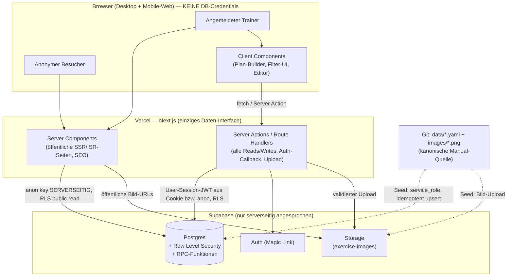
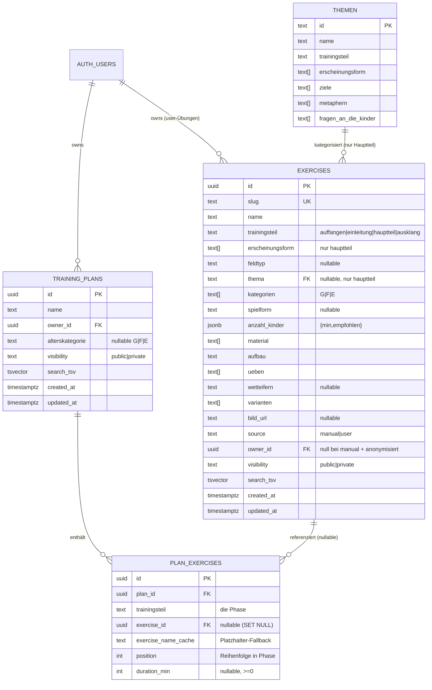
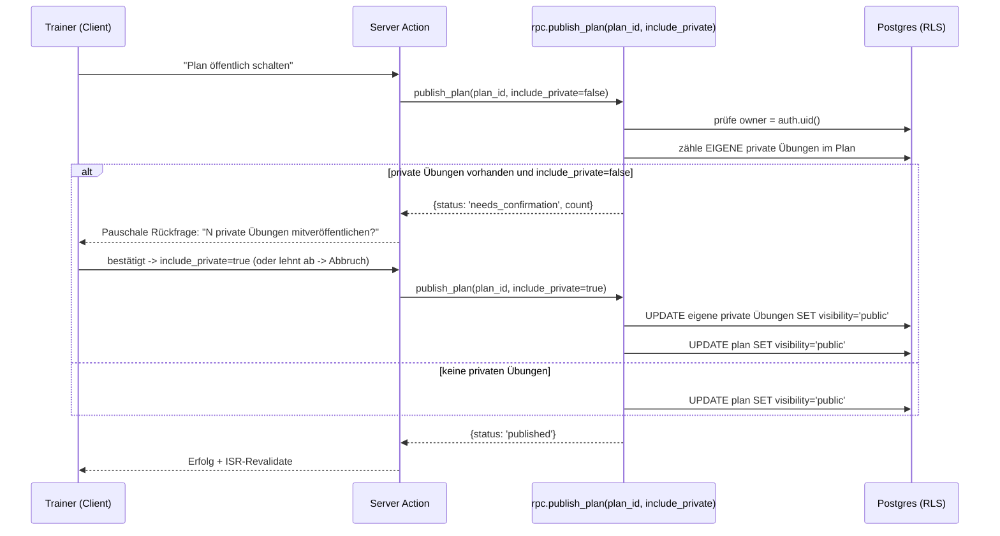

# Architektur-Plan: Kinderfussball Web-App (MVP)

**Datum:** 2026-05-31
**Status:** Architektur-Entwurf (deckt beide Epics ab)
**Grundlage:**
- `2026-05-31-webapp-requirements-epic.md` (Übungs-Verwaltungsplattform)
- `2026-05-31-trainingsplaner-requirements-epic.md` (Trainingsplaner)
- `2026-05-31-webapp-architektur-entscheid.md` (getroffener Stack-Entscheid)
- `2026-05-31-uebungs-datenbank-design.md` + `schema/uebung.schema.json` (kanonische Datenform)

Dieser Plan baut den bereits getroffenen Grobentscheid (Next.js + Supabase + Vercel)
zu einem umsetzbaren MVP-Architektur-Spec aus und beantwortet die offenen
`@Architect`-Fragen beider Epics.

---

## 1. Scope & Leitplanken

Ein MVP, das **beide Epics** trägt:

- **Übungskatalog** — öffentlich durchsuchen/filtern, Detailansicht, eigene Übungen erstellen/bearbeiten/löschen, Sichtbarkeit, Konto-Löschung mit Anonymisierung.
- **Trainingsplaner** — Pläne nach den 4 Trainingsteilen zusammenstellen, Dauer planen, verwalten, teilen, mobil durchführen, als PDF exportieren.

Architektur-Leitplanken aus den NFRs:
- Öffentliche Ansicht **ohne Konto** voll nutzbar und **SEO-fähig** → Server-Rendering.
- Schreiben **nur authentifiziert**, serverseitig gegen Fremdzugriff abgesichert → **RLS als primäre Autorisierung**.
- Grössenordnung: niedrige vierstellige Übungszahl, einige Dutzend gleichzeitige Nutzer → **keine Skalierungs-Sonderarchitektur nötig**, Standard-Postgres reicht.
- Mobil + Desktop, Deutsch, **kein Offline** (explizit out of scope).

---

## 2. Tech-Stack (bestätigt) & Begründung

| Schicht | Wahl | Begründung |
|--------|------|-----------|
| Framework | **Next.js (App Router, TypeScript)** | Server Components für SEO/öffentliche Seiten, Server Actions für Mutationen, eine Codebasis für Web + Mobile-Web |
| UI | **Tailwind CSS** | schnelle, konsistente, responsive UI; Print-Styles via `@media print` |
| DB | **Supabase Postgres** | relationales Modell passt 1:1 zu Übungen/Plänen; RLS als Autorisierung |
| Auth | **Supabase Auth (Magic Link)** | passwortlos, geringe Friktion für Hobby-Trainer |
| Storage | **Supabase Storage** | Feld-Diagramme (Manual-Seed + User-Uploads) |
| Hosting | **Vercel** | native Next.js-Integration, ISR, Edge |
| Auth-Bridge | **`@supabase/ssr`** | Cookie-basierte Session über Server Components + Server Actions |

Bewusst **nicht** im MVP: ORM-Schwergewicht (rohe SQL-Migrationen + generierte Typen reichen), eigener API-Layer (Supabase-Client + Server Actions genügen), Service Worker/PWA (Offline out of scope), serverseitiger PDF-Renderer (siehe §10).

---

## 3. System-Kontext



**Kernidee (server-only):** Der **Browser hält keine DB-Credentials** und spricht nie direkt
mit Supabase. Das einzige Daten-Interface ist der Next.js-Server. Interaktive Client
Components rufen **Server Actions / Route Handlers** auf; diese greifen mit dem passenden
Schlüssel auf Postgres zu. **RLS bleibt als zweite Schutzschicht** aktiv — selbst ein Bug im
Server-Code kann private Daten nicht freigeben.

**Schlüssel-Handhabung (verlässt nie den Server):**
- **`anon`-Key** — nur serverseitig, für anonyme öffentliche Reads. RLS bleibt aktiv (nur `public`-Zeilen). Wird **nicht** ins Browser-Bundle ausgeliefert.
- **User-Session (JWT in HttpOnly-Cookie via `@supabase/ssr`)** — pro Request serverseitig zu einem Supabase-Client gemacht; `auth.uid()` trägt die RLS-Eigentümer-Policies.
- **`service_role`-Key** — RLS-umgehend, **ausschließlich** im Seed-Script / vertrauenswürdigen Admin-Kontext. Niemals in der App-Request-Pipeline.

Optionale Härtung auf Supabase-Projektebene (Defense-in-Depth): Zugriff auf die Data-API
zusätzlich per Netzwerk-/Rollen-Restriktion einschränken. Die funktionale Garantie liefert
aber bereits server-only + RLS.

---

## 4. Datenmodell



### 4.1 Designentscheide im Modell

- **Phasen sind kein eigenes Table.** Die 4 Trainingsteile sind eine feste, unveränderliche Sequenz (Erfolgskriterium 1). Sie werden als `trainingsteil`-Wert auf `plan_exercises` geführt und in der UI als feste Reihenfolge gerendert. Kein `phases`-Table, keine konfigurierbare Reihenfolge → weniger Komplexität, kein Risiko widersprüchlicher Phasen-Order.
- **Eine Übung = genau ein `trainingsteil`** (durch die Daten bestätigt). Die Phasen-Bindung (Erfolgskriterium 2 Planer) ist damit ein einfacher Gleichheits-Check `plan_exercises.trainingsteil = exercises.trainingsteil`.
- **`erscheinungsform`/`thema` nur bei Hauptteil** wird per CHECK-Constraint erzwungen (siehe DDL), nicht nur in der UI.
- **Manual vs. User über `source` + `owner_id`** (löst Übungs-Epic Frage 3): `source='manual'` ⇒ `owner_id IS NULL`, schreibgeschützt via RLS. `source='user'` ⇒ `owner_id` gesetzt.
- **Filter-Vokabular** bleibt kanonisch in `data/vokabular.yaml` und wird **als generiertes TS-Modul** mit-deployed (Dropdown-Werte) **und** als CHECK-Enums in der DB gespiegelt. Ein Test hält beide synchron (wie schon im Daten-Design gefordert). Kein separates `vocabulary`-Table → keine Drift-Quelle.

### 4.2 Schema (DDL-Skizze)

```sql
-- Enums als CHECK (Quelle der Wahrheit = uebung.schema.json)
create table exercises (
  id uuid primary key default gen_random_uuid(),
  slug text unique not null,
  name text not null,
  trainingsteil text not null
    check (trainingsteil in ('auffangen','einleitung','hauptteil','ausklang')),
  erscheinungsform text[] not null default '{}',
  feldtyp text check (feldtyp in ('kleinfeld','grossfeld','freies_feld')),
  thema text references themen(id),
  kategorien text[] not null default '{}',
  spielform text,
  anzahl_kinder jsonb,
  material text[] not null default '{}',
  aufbau text not null,
  ueben text[] not null default '{}',
  wetteifern text,
  varianten text[] not null default '{}',
  bild_url text,
  source text not null default 'user' check (source in ('manual','user')),
  owner_id uuid references auth.users(id) on delete set null,
  visibility text not null default 'public' check (visibility in ('public','private')),
  search_tsv tsvector,
  created_at timestamptz not null default now(),
  updated_at timestamptz not null default now(),
  -- Herkunfts-Konsistenz
  constraint manual_has_no_owner check (source <> 'manual' or owner_id is null),
  -- Hauptteil-spezifische Felder nur bei Hauptteil
  constraint hauptteil_only_fields check (
    trainingsteil = 'hauptteil'
    or (erscheinungsform = '{}' and thema is null)
  )
);

create table training_plans (
  id uuid primary key default gen_random_uuid(),
  name text not null,
  owner_id uuid not null references auth.users(id) on delete cascade,
  alterskategorie text check (alterskategorie in ('G','F','E')),
  visibility text not null default 'private' check (visibility in ('public','private')),
  search_tsv tsvector,
  created_at timestamptz not null default now(),
  updated_at timestamptz not null default now()
);

create table plan_exercises (
  id uuid primary key default gen_random_uuid(),
  plan_id uuid not null references training_plans(id) on delete cascade,
  trainingsteil text not null
    check (trainingsteil in ('auffangen','einleitung','hauptteil','ausklang')),
  exercise_id uuid references exercises(id) on delete set null,
  exercise_name_cache text,           -- Fallback-Anzeige wenn Übung weg/unsichtbar
  position int not null,
  duration_min int check (duration_min >= 0),
  unique (plan_id, trainingsteil, position)
);

create index exercises_search_idx on exercises using gin(search_tsv);
create index exercises_filter_idx on exercises (trainingsteil, visibility);
create index exercises_owner_idx on exercises (owner_id);
create index plan_exercises_plan_idx on plan_exercises (plan_id);
create index plans_search_idx on training_plans using gin(search_tsv);
```

`search_tsv` wird per Trigger aus `name`, `aufbau`, `ueben`, `material` (Übungen) bzw.
`name` (Pläne) mit der `german`-Konfiguration befüllt; `pg_trgm` zusätzlich für tolerante
Namenssuche.

---

## 5. Autorisierung (RLS — die Sicherheitsgrenze)

Alle Tabellen: `enable row level security`. RLS ist die **einzige** Autorisierungsschicht;
die App verlässt sich nicht auf clientseitige Checks (NFR 3 beider Epics).

```sql
-- EXERCISES
create policy ex_select on exercises for select
  using (visibility = 'public' or owner_id = auth.uid());
create policy ex_insert on exercises for insert
  with check (owner_id = auth.uid() and source = 'user');
create policy ex_update on exercises for update
  using (owner_id = auth.uid() and source = 'user')
  with check (owner_id = auth.uid() and source = 'user');
create policy ex_delete on exercises for delete
  using (owner_id = auth.uid() and source = 'user');

-- TRAINING_PLANS
create policy pl_select on training_plans for select
  using (visibility = 'public' or owner_id = auth.uid());
create policy pl_write on training_plans for all
  using (owner_id = auth.uid()) with check (owner_id = auth.uid());

-- PLAN_EXERCISES (Sichtbarkeit/Schreibrecht erbt vom Eltern-Plan)
create policy pe_select on plan_exercises for select using (
  exists (select 1 from training_plans p where p.id = plan_id
          and (p.visibility = 'public' or p.owner_id = auth.uid())));
create policy pe_write on plan_exercises for all using (
  exists (select 1 from training_plans p where p.id = plan_id
          and p.owner_id = auth.uid()))
  with check (
  exists (select 1 from training_plans p where p.id = plan_id
          and p.owner_id = auth.uid()));
```

**Konsequenzen, die Epic-Anforderungen direkt erfüllen:**
- Manual-Übungen (`owner_id IS NULL`) sind für niemanden schreibbar (keine INSERT/UPDATE/DELETE-Policy trifft zu).
- Eigene private Übungen sieht **nur der Owner** — auch im Planer-Auswahldialog (löst Übungs-Epic Frage 8 / Planer-Frage 5 auf Datenebene: derselbe `select`-Filter trägt überall).
- Ein öffentlicher Plan, der eine fremde, inzwischen privatisierte Übung referenziert, liefert für den Betrachter über die `pe_select`/`ex_select`-Kette schlicht keine Übungsdaten → die App zeigt den **Platzhalter aus `exercise_name_cache`** (siehe §7.3).

---

## 6. Rendering- & Routing-Strategie

```
app/
  (public)/                      # SSR/ISR, anon Supabase-Client, SEO
    page.tsx                     # Übungsliste + Filter (Erfolgskrit. Übungs-Epic)
    uebung/[slug]/page.tsx       # Übungs-Detail (inkl. Themen-Infos bei Hauptteil)
    plaene/page.tsx              # Öffentliche Plan-Suche/Discovery (Planer EK14)
    plan/[id]/page.tsx           # Öffentliche Plan-Ansicht (Planer EK13)
  (auth)/
    login/page.tsx               # Magic-Link
    auth/callback/route.ts       # Session-Austausch
  (app)/                         # nur eingeloggt (Middleware-Guard + RLS)
    neu/page.tsx                 # Übung erstellen
    uebung/[slug]/edit/page.tsx  # Übung bearbeiten
    meine-uebungen/page.tsx
    plan/neu/page.tsx            # Plan-Builder
    plan/[id]/edit/page.tsx      # Plan-Builder (bearbeiten)
    meine-plaene/page.tsx
    plan/[id]/durchfuehrung/page.tsx  # Mobile Durchführungsansicht (EK15)
    plan/[id]/print/page.tsx     # Print-optimierte Ansicht für PDF (EK16)
  konto/page.tsx                 # Konto löschen (Übungs-Epic)
lib/
  supabase/{server,client,middleware}.ts
  queries/{exercises,plans}.ts   # zentrale, getypte Query-Builder
  vocab.ts                       # generiert aus data/vokabular.yaml
components/...
supabase/
  migrations/*.sql
  functions/                     # RPC (publish_plan, delete_account)
scripts/
  seed.ts                        # YAML+Bilder -> Postgres/Storage (idempotent)
```

- **Öffentlich = Server Components + ISR.** Erfüllt SEO (NFR 2 Übungs-Epic) und <1s-Antwort. Revalidierung on-demand nach Mutationen. Datenzugriff serverseitig mit dem anon-Key.
- **Interaktiv = Client Components**, aber **ohne eigenen DB-Client** (server-only). Plan-Builder, Filter-Sidebar und Formulare halten lokalen UI-State und sprechen die DB ausschließlich über **Server Actions / Route Handlers** an. Filter/Suche laufen entweder als URL-Parameter gegen Server Components (SSR-Refetch) oder über einen schlanken Route-Handler — kein direkter Browser→Supabase-Call.
- **Kein `@supabase/supabase-js` im Client-Bundle** für Datenzugriff. Der einzige clientseitige Supabase-Kontakt ist der Auth-Magic-Link-Flow, dessen Session serverseitig im Cookie landet.
- **Auth-Guard** in der Middleware für `(app)/*` — UX-Schutz; die echte Durchsetzung bleibt RLS.

---

## 7. Schlüssel-Flows

### 7.1 Öffentliches Filtern (conditional Erscheinungsform/Thema)

Die Filter-UI blendet `Erscheinungsform`/`Thema` nur ein, wenn `trainingsteil = hauptteil`
gewählt ist (Übungs-Epic EK2). Die Query baut dynamisch `WHERE`-Klauseln:
`trainingsteil`, `kategorien && :selected` (Mehrfachauswahl, Überlappung — EK3),
`anzahl_kinder` (Gesamtbedarf — EK4), Volltext über `search_tsv`. Alterskategorie-Filter
hängt von **korrigierten Kategorie-Daten** ab (Übungs-Epic offene Frage 1 → Daten-Precondition,
keine Architektur-Frage).

### 7.2 Plan veröffentlichen mit eigenen privaten Übungen (transaktional)

Erfolgskriterium 9 (Planer) verlangt eine atomare, pauschale Entscheidung. Das gehört in
eine **Postgres-RPC** (eine Transaktion, keine Race-Condition zwischen mehreren Client-Writes):



Lehnt der Trainer ab, bleibt alles privat (keine Mutation). Die RPC läuft `SECURITY DEFINER`
mit explizitem Owner-Check, damit sie auch die referenzierten privaten Übungen umstellen darf.

### 7.3 Referenzielle Integrität (offene Architekt-Frage 2)

**Entscheid:** `plan_exercises.exercise_id` ist FK mit `ON DELETE SET NULL`; beim Hinzufügen
wird `exercise_name_cache` mitgespeichert. Beim Rendern eines Plans:
- Übung sichtbar → volle Daten via Join.
- Übung gelöscht (`exercise_id IS NULL`) **oder** für den Betrachter unsichtbar (RLS liefert
  keine Zeile) → **Platzhalter** „Übung nicht mehr verfügbar" aus `exercise_name_cache`; die
  Plan-Struktur (Phasen, Reihenfolge, Dauer) bleibt intakt.

Kein Voll-Snapshot des Übungsinhalts im MVP (vermeidet Daten-Duplikation/Staleness); der
Name-Cache genügt für eine verständliche Platzhalter-Anzeige.

### 7.4 Konto löschen mit Anonymisierung (Übungs-Epic)

RPC `delete_account()`: setzt bei öffentlichen Übungen des Users `owner_id = NULL`
(anonymisiert, bleibt erhalten, wird durch fehlende Update-Policy unveränderlich), löscht
private Übungen, löscht den Auth-User. Eigene Pläne hängen per `ON DELETE CASCADE` am User —
für den MVP werden Pläne mit dem Konto gelöscht (öffentliche Pläne anonymisiert zu erhalten
ist nicht gefordert; falls gewünscht, analog zu Übungen behandeln → Produktentscheid).

---

## 8. Identifikator-Strategie (offene Architekt-Fragen)

- **Primärschlüssel überall `uuid`** (kollisionsfrei über mehrere Nutzer — löst Übungs-Epic Frage 2).
- **Übungen** behalten zusätzlich `slug`:
  - Manual-Übungen: `slug` = bestehende YAML-`id` (sprechend, stabil, SEO).
  - User-Übungen: `slug` = `slugify(name)` + kurzer Suffix bei Kollision.
  - Öffentliche Detail-Route `/uebung/[slug]`.
- **Pläne**: Route über `uuid` (`/plan/[id]`). Ein sprechender Slug ist für Pläne nicht
  nötig; geteilte Links nutzen die nicht-erratbare UUID (de-facto „unlisted" für private wird
  zusätzlich durch RLS erzwungen). Optionaler `share_slug` später nachrüstbar.

---

## 9. Storage (Feld-Diagramme)

- Ein **öffentlicher Bucket `exercise-images`** für die *Auslieferung* (Lesen) der Diagramme;
  Diagramme sind ohnehin öffentlicher Inhalt. Manual-Bilder werden beim Seed hochgeladen;
  `bild_url` zeigt darauf. User-Uploads landen unter `user/<owner_id>/<exercise_id>.<ext>`.
- **Upload server-only:** Der Browser lädt nicht direkt in den Storage. Die Datei geht an einen
  **Route Handler / eine Server Action**, die Typ und Grösse validiert und dann serverseitig
  in den Storage schreibt. Schreibzugriff auf den Bucket ist auf den Server beschränkt.
- **Upload-Rahmen (offene Übungs-Epic-Frage 4):** max. ~5 MB, Formate `jpg/png/webp`,
  serverseitige Validierung vor dem Storage-Put.
- **Verwaiste Bilder:** beim Übung-Löschen entfernt die Lösch-Action das Storage-Objekt;
  ergänzend ein periodischer Cleanup-Job (Vercel Cron / Supabase Scheduled Function), der
  Objekte ohne DB-Referenz entfernt. Bei Anonymisierung bleiben öffentliche Bilder erhalten.
- Übungen ohne Diagramm → **Ersatzdarstellung** in der UI (NFR 5 Übungs-Epic).

---

## 10. PDF-Export (Planer EK16)

**MVP-Entscheid: Browser-natives Drucken.** Eine print-optimierte Route
`/plan/[id]/print` mit `@media print`-Styles (Phasen, Übungen, Dauer, eingebettete
Diagramme); der Trainer nutzt „Als PDF speichern/drucken". **Null zusätzliche Infrastruktur**,
funktioniert mobil und Desktop, Diagramme sind als `` enthalten.

Upgrade-Pfad, falls automatisch generierte/server-seitige PDFs nötig werden (z. B. Versand):
Headless-Chrome in einer Vercel-Function oder Supabase Edge Function, der dieselbe Print-Route
rendert. Bewusst nicht im MVP (YAGNI).

---

## 11. Seed-Pipeline (Git YAML → Postgres)

`scripts/seed.ts` (Node/TS, via CI oder manuell):
1. liest `data/uebungen/*.yaml` + `data/themen/*.yaml`,
2. **upsert per `slug`** (idempotent) → `exercises` mit `source='manual'`, `owner_id=NULL`,
3. lädt `images/*.png` in den Storage-Bucket, setzt `bild_url`,
4. validiert vorher gegen `schema/uebung.schema.json` (kein Drift).

Die **YAML in Git bleiben kanonisch** für Manual-Übungen; der Seed überschreibt User-Daten nie
(nur `source='manual'`-Zeilen werden geupsertet).

---

## 12. NFR-Abdeckung

| NFR | Architektur-Antwort |
|-----|---------------------|
| Öffentlich ohne Konto + SEO | Server Components/ISR, anon-Key-Reads unter RLS |
| <1s Filter/Suche/Plan-Load | Postgres-Indizes (GIN für FTS, B-Tree für Filter), kleine Datenmenge, ISR-Cache |
| Schreiben nur auth + Fremdzugriff abgesichert | Server-only-Zugriff (Browser ohne DB-Credentials) + RLS-Policies als zweite Schicht; Auth-Guard nur als UX |
| DB nicht öffentlich einsehbar | Browser spricht nie direkt mit Supabase; anon/service_role-Keys bleiben serverseitig; private Daten zusätzlich durch RLS unzugänglich |
| Mobil + Desktop, Deutsch | Tailwind responsive; dedizierte mobile Durchführungsansicht; UI/Inhalte de |
| Kein Offline | keine PWA/Service-Worker — bewusst weggelassen |
| Diagramm-Qualität/Ladezeit | Storage + `next/image`-Optimierung; Platzhalter bei fehlendem Bild |

---

## 13. Aufgelöste offene Fragen & verbleibende Produktentscheide

**Architektonisch entschieden (in diesem Plan):**
- Dauer je Übung → `plan_exercises.duration_min` (pro Zuordnung, nicht an der Übung) — Planer-Frage 1. ✅
- Referenzielle Integrität → FK `ON DELETE SET NULL` + `exercise_name_cache`-Platzhalter, RLS-gefiltertes Rendern — Planer-Frage 2. ✅
- Identifikatoren → `uuid` PK überall, `slug` für Übungen, UUID-Route für Pläne — Planer-Frage 3 / Übungs-Epic-Fragen 2+3. ✅
- Bild-Upload-Rahmen + Orphan-Cleanup — Übungs-Epic-Frage 4. ✅
- Eigene private Übungen im Planer/eigener Suche sichtbar → fällt aus dem `select`-RLS-Filter heraus — Planer-Frage 5 / Übungs-Epic-Frage 8 (Empfehlung; PO-Bestätigung). ✅

**Bleiben Produktentscheide (nicht-blockierend, Default vorgeschlagen):**
- Ziel-Trainingsdauer-Prüfung gegen Phasen-Richtanteile — MVP: nur Summen (Planer-Frage 4).
- Alterskategorie-Daten-Korrektur — Daten-Precondition, kein Architektur-Thema (Übungs-Epic-Frage 1).
- Sollen **öffentliche Pläne** bei Konto-Löschung anonymisiert erhalten bleiben (analog Übungen) oder mitgelöscht werden? — MVP-Default: mitgelöscht (`CASCADE`).

---

## 14. Build-Sequenz (Milestones, Story-gemappt)

Reihenfolge respektiert Abhängigkeiten beider Epics. Übungs-Epic zuerst (Plattform-Fundament),
dann Planer.

1. **M0 — Fundament:** Next.js + Supabase + Vercel scaffold, `@supabase/ssr`-Auth, Migrationen-Setup, `vocab.ts`-Generierung.
2. **M1 — Daten & Seed (Übungs-Epic Story 1):** Schema `exercises`/`themen`, RLS, `seed.ts`, Bilder in Storage.
3. **M2 — Öffentlicher Katalog (Übungs-Epic Stories 2+3):** Liste + Filter (conditional), Detailansicht mit Themen-Infos. SEO/ISR.
4. **M3 — Auth + eigene Übungen (Übungs-Epic Stories 4–8):** Login, Erstellen/Bearbeiten/Sichtbarkeit/Löschen, eigene Übersicht, Konto löschen (Anonymisierungs-RPC).
5. **M4 — Plan-Datenmodell (Planer Story 1):** `training_plans` + `plan_exercises` + RLS.
6. **M5 — Plan erstellen & Dauer (Planer Stories 2+3):** Builder mit Phasen-Bindung + Hauptteil-Erscheinungsform-Filter + optionaler Alterskategorie-Hinweis; Dauer + Summen.
7. **M6 — Plan verwalten & teilen (Planer Stories 4–6):** bearbeiten/umsortieren/löschen, eigene Plan-Übersicht, `publish_plan`-RPC.
8. **M7 — Öffentliche Pläne + Nutzung (Planer Stories 7–10):** öffentliche Ansicht, Discovery-Suche, mobile Durchführungsansicht, Print/PDF.

---

## 15. Risiken & Gegenmassnahmen

| Risiko | Gegenmassnahme |
|--------|----------------|
| Phasen-Bindung (`exercise.trainingsteil == plan_exercises.trainingsteil`) nur in App geprüft | Zusätzlich DB-Trigger als Sicherung; App filtert die Auswahl bereits |
| RLS-Policy-Lücke = Sicherheitsleck | RLS-Tests (pgTAP / Integrationstests) je Policy; Default-Deny durch RLS-Aktivierung |
| Alterskategorie-Daten unkorrigiert → Filter unbrauchbar | Daten-Precondition vor M2-Release klären (Übungs-Epic-Frage 1) |
| `publish_plan`-RPC-Rechte (`SECURITY DEFINER`) | strikter Owner-Check als erste Anweisung; nur eigene private Übungen umstellbar |
| Print-PDF-Layout inkonsistent über Browser | print-CSS testen; bei Bedarf Upgrade auf Headless-Chrome-Renderer |
```
